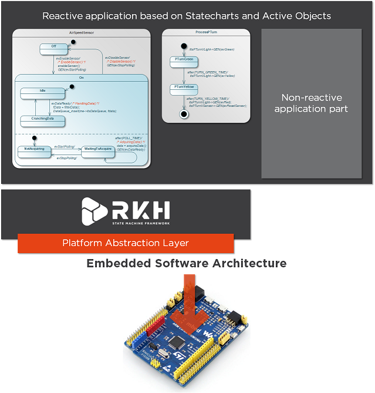

# RKH - A framework to build software for reactive and real-time embedded systems

 

RKH (Reactive frameworK for Hierarchical state machines) is a framework used 
to build software for reactive and real-time embedded systems in a safely and 
timely way. It is composed of modules, procedures and supporting tools; such as 
a method for implementing and executing flat and Statechart state machines, 
asynchronous and synchronous messaging, cross-platform abstraction, runtime 
tracing, time management, dynamic memory mechanism to deal with fragmentation, 
unit test harness, among others. These elements make up the needed 
infrastructure to build apps in embedded systems. 

Frequently, real-time embedded system’s development is slow, error-prone, and 
hard. Thanks to the use of RKH, this has been greatly improved. RKH enables 
higher quality and functionality, and decreases the development time. Since 
common software infrastructure do not have to be reimplemented, there is no 
need to reinvent the wheel over and over again. 

Moreover, by using RKH, developers can build softwares in a user-friendly, 
well-defined, formal and structured environment. This is achieved because 
RKH's infrastructure enables them to code using event-driven programming 
paradigm.

Due to its event-driven nature, a state machine is usually employed to 
represent the dynamic behaviour of a reactive application. That is why RKH 
provides a powerful and efficient module for building and executing state 
machines. It almost entirely supports UML state machines semantics, which are 
based on David Harel’s statechart formalism. 

RKH also provides the complete infrastructure for the execution of state 
machines which supports both synchronous and asynchronous event triggers. In 
the case of the asynchronous event triggers, the state machine is executed 
according to the Active Object execution model which is the UML concurrency 
unit. In RKH framework, an Active Object can be made up by one or more state 
machines.

RKH not only enables to develop a reactive application from the ground up, but 
also to reinforce the reactive part of an existing functional application.

RKH includes a platform abstraction layer (PAL) which allows the framework to 
be portable. By allowing the PAL to be replaced, the framework can be easily 
ported to different target platforms. The PAL contains the abstraction of 
operating system, compiler, IDE and hardware components.

RKH allows developers to verify and validate the reactive application’s 
behaviour at runtime by means of its built-in tracer, which is a flexible, 
configurable and cross-platform software module. In addition, RKH provides a 
very simple but powerful console application to visualize the trace events’ 
output in a legible manner.
Since RKH has been carefully developed from the ground up by using best 
principles and practices of software engineering, such as OOD 
(Object-Oriented Design), software modeling, design patterns, TDD 
(Test-Driven Development), continuous integration, among others; it is 
considered a safe, flexible, maintainable, and reusable software.

In conclusion, RKH is a framework that provides the infrastructure for the 
quick and safe development of reactive applications for real-time embedded 
systems. It supplies an efficient method for both implementing and executing 
Statecharts.
It also encourages the embedded software community to apply best principles 
and practices of software engineering for building flexible, maintainable and 
reusable software.
And finally, RKH improves embedded softwares by increasing their quality and 
functionality and decreased their development time. 

## Examples

Repo [rkh-examples](https://github.com/vortexmakes/rkh-examples) contains a 
collection of open source examples based on RKH framework to develop embedded 
software for several platforms. In this context, it refers to combination of 
CPU architecture, compiler or IDE, and operating system. Also, rkh-examples 
includes some demostrative and cross-platform applications running under 
Windows and Linux to improve and fast development cycle.

### Other embedded applications based on RKH framework
- [Spora](https://sporaio.com/): open source project to build wearables.
- [DIMBA](https://github.com/vortexmakes/dimba): IoT application, using MQTT 
protocol over GSM network.
- [YipiesAgro](https://github.com/vortexmakes/AgroIoT): IoT application, for 
precision agriculture.

## Documentation

Documentation exists in the [reference manual](https://vortexmakes.com/rkh/). 
Also, additional information is located in the  official site 
https://www.vortexmakes.com/. For now, it is in Spanish.

## How to collaborate on RKH?

Would you like to collaborate with RKH? Great, go ahead!. First of all, you 
must get the project from its official repository: 
> $ git clone --recurse-submodules https://github.com/vortexmakes/RKH

Then, you are ready to share your bug fixes and improvements with other users. 
Your contributions may enhance your professional training and increase your 
skills about embedded software development, specially in responsive systems. 
As a means of keeping a code quality, we strongly recommend you to use the 
‘pull request’ mechanism to include your contributions. Once a pull request is 
opened, you will be able to discuss and review the potential changes with 
collaborators and add follow-up commits before your changes are merged into 
the base branch. You can also use the test harness that RKH provides. 
If you are interested in collaborating with the project but you have not made 
any specific contribution yet, there is a list of desirable features available. In this way, you will be able to be part of the framework. By using a feature 
from the list, you can both develop and include it to the project. That is why, our goal is that you can easily join the RKH’s developer community.

## Other implementations

Open-source frameworks that support Statecharts.
- Quantum Leap - [http://www.state-machine.com/](http://www.state-machine.com/)

## Licensing

RKH is distributed under the terms of the GNU General Public License v3.0 with 
the following clarification and special exception.

> Linking this framework statically or dynamically with other modules is 
> making a combined work based on this framework. Thus, the terms and 
> conditions of the GNU General Public License cover the whole combination.
>
> As a special exception, the copyright holders of this framework give you
> permission to link this framework with independent modules to produce an
> executable, regardless of the license terms of these independent modules, and
> to copy and distribute the resulting executable under terms of your choice,
> provided that you also meet, for each linked independent module, the terms
> and conditions of the license of that module. An independent module is a
> module which is not derived from or based on this framework. If you modify 
> this framework, you may extend this exception to your version of the 
> framework, but you are not obligated to do so. If you do not wish to do so, 
> delete this exception statement from your version.

See GPL license copy in [copying.txt](copying.txt) file.

### Why does RKH use the GPL?

RKH is licensed under terms of GPL, since its main goal is to grant everyone 
the freedom to copy, redistribute, understand, and modify a program. A crucial 
aspect of free software is that users are free to cooperate. It is absolutely 
essential to permit users, who wish to help each other, to share their bug 
fixes and improvements with other users. For this reason, RKH’s goal is to be 
a free software; as FSF says, ‘Free software is a matter of liberty, not of 
price’.

### Licensing scheme
- GPLv3 + linking exception license, which will allow a customer to link 
proprietary source code. Observe that, the GPLv3 can be used for research & 
development and educational purposes (academic purposes).
- Commercial license, when the source code of your application should not be 
published under the GNU GPLv3 license (closed source code), please, contact us. See Contact information section.

### Some important references about GPL
- https://www.gnu.org/philosophy/free-sw.en.html
- https://www.gnu.org/licenses/licenses.en.html#WhatIsCopyleft
- https://www.gnu.org/licenses/gpl-faq.en.html#WhyDoesTheGPLPermitUsersToPublishTheirModifiedVersions
- https://www.gnu.org/licenses/gpl-faq.en.html#GPLRequireSourcePostedPublic
- https://www.gnu.org/licenses/gpl-faq.en.html#ReleaseUnderGPLAndNF
- https://www.gnu.org/licenses/gpl-faq.en.html#GPLModuleLicense
- https://www.gnu.org/licenses/gpl-faq.en.html#WillYouMakeAnException
- https://en.wikipedia.org/wiki/GPL_linking_exception 
- https://www.gnu.org/software/classpath/license.html
- https://www.fsf.org/blogs/rms/selling-exceptions
- http://www.erika-enterprise.com/index.php/erika3/licensing.html

## Contact information

- Official site: http://vortexmakes.com/que-es/
- RKH GitHub: https://github.com/vortexmakes/RKH
- RKH Sourceforge: https://sourceforge.net/projects/rkh-reactivesys/
- e-mail: lf@vortexmakes.com

## RKH Release notes

Changes between [V3.1.0](https://github.com/vortexmakes/RKH/releases/tag/v3.1.0) and V3.2.0 released 08/01/2019

- Added Ceedling, LCOV, Codecov, Cppcheck, Uno and Travis CI support!.
  The main purpose of this is to improve the quality of source code, 
  by means of Continuous Integration process.
- Included a new alternative in the license scheme: GPLv3 + linking exception.
- Added Publish-Subscriber module. It addresses the specific issue 
  of how to notify a set of interested active objects (clients) in a timely 
  way that a value that they care about has changed. The basic solution 
  offered by this module is to have the clients "subscribe" to the server 
  to be notified about the value in question according to the policy: 
  "when the value changes, receiving a proper event carrying the value of
  interest".
- Added RKH_SMA_DISPATCH() polymorphic function in native scheduler.
- Added a deploy script to release new versions.
- Enhanced README file.
- From this version, you must include the files rkhfwk_rdygrp.h and 
  rkhfwk_rdygrp.c located in source/fwk/inc and source/fwk/src 
  respectively, to maintain the backward-compatiblity with the existing 
  application projects.
